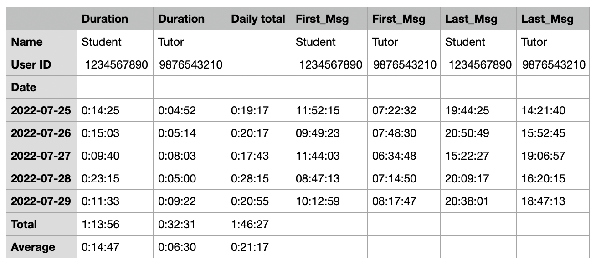

# telegram-voice-message-duration-reporter

Reads [Telegram](https://telegram.org) conversations [exported to
JSON](https://telegram.org/blog/export-and-more) and builds a CSV file with a report on
total duration of voice messages on a per user per day basis.

## Why?

This is a real-world project. The requirement is to be able to produce visual graph
reports of students' engagement measured by the length of voice messages they exchange
with their tutors over the Telegram app.

## Prerequisites
- Python 3
- Telegram Desktop

## Usage

### As standalone script

1. Export conversations in the JSON format with Telegram Desktop
2. Put the exported `result.json` file and the [reporter.py](app/reporter.py) script in
the same directory
3. On Windows simply double click `reporter.py`. On Unix systems open a terminal and run

    ```bash
    ./reporter.py
    ```
4.  This will generate a CSV file in the same directory with the following name pattern:
`report.<timestamp>.csv`.

#### Sample report



### As local server

One time setup:

```bash
python3 -m venv virtual_env
. virtual_env/bin/activate
pip install -r requirements.txt
```

Run the server:

```bash
python app/main.py
```

Open http://localhost:5000 and upload `result.json`.

### As Docker cointainer

```bash
docker build -t telegram-voice-message-duration-reporter:latest .
docker run \
  -d \
  -p 5000:5000 \
    telegram-voice-message-duration-reporter:latest
```

Open http://localhost:5000 and upload `result.json`.

### With Docker Compose

```bash
docker-compose up -d
```

### Customising the port

You can change the port by setting the `APP_PORT` environment variable, e.g. by
prefixing the `python` and/or `docker-compose` commands above. For `docker`, you can use the `-e` flag, e.g.: `-e APP_PORT=5002`.

## Unit tests

```bash
pytest
```