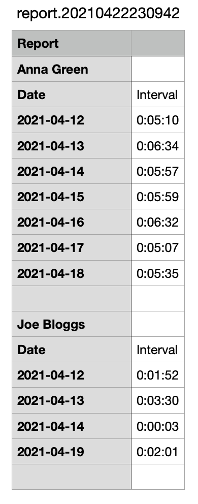

# telegram-voice-message-duration-reporter

Reads [Telegram](https://telegram.org) conversations [exported to
JSON](https://telegram.org/blog/export-and-more) and builds a CSV file with a report on
total duration of voice messages on a per user per day basis.

## Prerequisites
- Python 3
- Telegram Desktop

## Usage

1. Export conversations in the JSON format with Telegram Desktop
2. Put the exported `result.json` file and the `report.py` script in the same directory
3. On Windows simply double click `report.py`. On Unix systems open a terminal and run

    ```bash
    ./report.py
    ```

This will generate a CSV file in the same directory with following name pattern:
`report.<datetime>.csv`.

Sample report:


